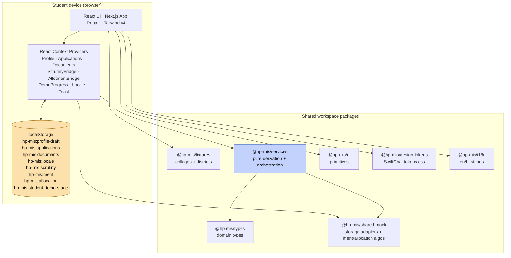
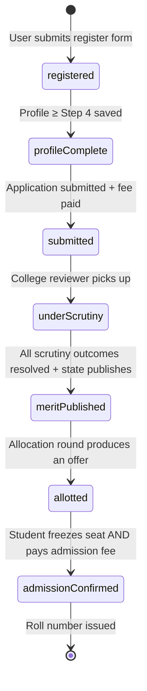
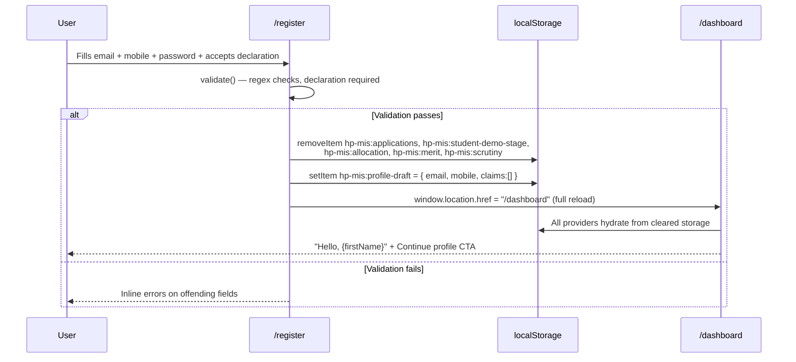
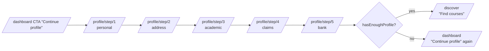
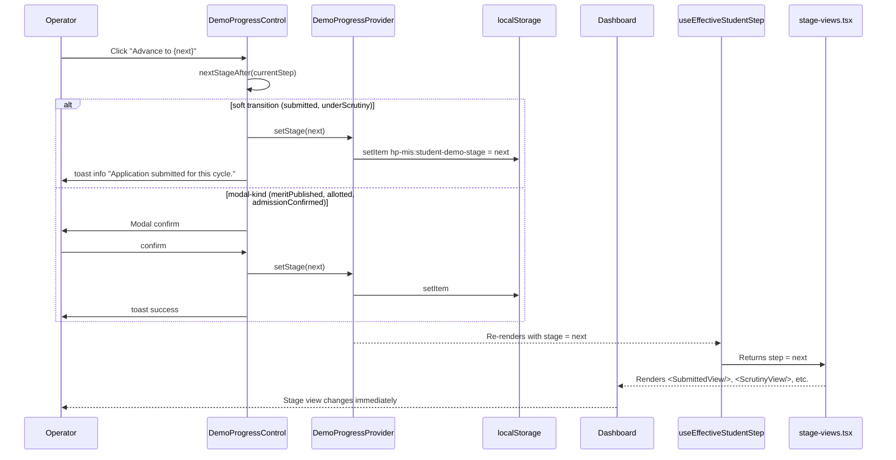

# HP Higher Education MIS — Student App: Project Report

> **Document scope:** the SwiftChat-style student-facing mini-app (`apps/student`).
> **Companion report:** `docs/PORTAL_APP_REPORT.md` covers the official admin portal (`apps/portal`).
> **Last verified:** evidence in this report is grounded in the working tree at the time of writing (33 page routes, 8 React Context providers, 6 shared workspace packages, no Node backend).

---

## 1. Project Title

**HPU Admission — Student Mini App**
Unified undergraduate admission journey for colleges affiliated to Himachal Pradesh University, delivered as a SwiftChat-style mobile-first web experience.

---

## 2. Executive Summary

The Student App is one of two surfaces inside the HP Higher Education MIS monorepo. It guides a school-leaving applicant through the full admission lifecycle — register, complete profile, discover eligible courses, apply, watch the application progress through scrutiny, see the published merit list, respond to a seat allotment, pay the admission fee, and finally see admission confirmed.

The app is built in Next.js 16 (App Router) with React 19 and Tailwind CSS v4. There is **no backend service** in this build: every persistent piece of state (profile draft, applications, allocations, language preference) is held in React Context and persisted to the browser's `localStorage`. A typed service layer (`@hp-mis/services`) sits between the providers and the UI so the eventual swap to a real API is a mechanical change, not a refactor.

The design system is the SwiftChat Design System (Montserrat for Latin, Mukta for Devanagari, brand blue `#386AF6`, pill controls, friendly cards). The app is bilingual (English + Hindi) on every Tier-1 screen.

A core feature is the **demo progression system**: an operator-only panel on the dashboard that can force the student's effective step ("Submitted" → "Under scrutiny" → "Merit published" → "Allotted" → "Admission confirmed") without mutating any real provider state. Every page that renders stage-dependent content — dashboard, applications list, allotment page, payment page, the post-submit landing, and the merit lookup — reads from a single hook that returns the **effective step** (demo override or real flow), so all surfaces stay in lockstep during a live demo.

---

## 3. Problem Statement

Undergraduate admission to HPU's affiliated colleges is currently fragmented across paper forms, college websites, and disconnected portals. Students travel between districts to chase information, lose track of which document was rejected, and have no single place to monitor merit + allotment + admission status. The platform consolidates the entire applicant lifecycle into one mobile-first surface so a student in Lahaul & Spiti has the same affordances as a student in Shimla.

---

## 4. Project Objectives

1. **Single application surface** — registration through admission confirmation in one app.
2. **Bilingual first** — every Tier-1 screen renders in English and Hindi.
3. **Mobile-first** — designed for the canonical 360px viewport, scales up cleanly to tablet and desktop.
4. **Trust-building UX** — official Government of Himachal Pradesh / HPU branding, clear status visualisation, no demo-feel copy in production strings.
5. **Production-ready architecture** — typed domain model, services layer, design tokens, shared UI primitives. No hard-coded hex, no app-local form re-implementations.
6. **Demo-ready** — a presenter can walk an audience through the full lifecycle in under five minutes via the operator demo control.

---

## 5. Target Users

| User | Profile | Primary surface |
|---|---|---|
| **Student applicant** | School-leaving (Class 12) candidate, age 17–19, accessing on mobile (Android predominantly), often on flaky 3G/4G | The full app — every route under `apps/student/app/**` |
| **Operator / presenter** | Internal stakeholder running a demo for officials | Same UI plus the dashboard's **Operator progression** control |
| **Helpdesk staff** | Department of Higher Education support staff | The student's view (read-only walkthrough during support calls) |

The app is **not** intended for college / state administrators. They use the portal app (`apps/portal`).

---

## 6. Scope of the Platform

### In scope (V1)
- Student account creation (email + mobile + password)
- Five-step profile builder (personal → address → academic → claims → bank)
- Course discovery against eligibility rules
- Application creation with combination preferences (BA up to 6, BSc up to 3)
- Document upload, preview, and rejection-fix flow
- Application submission with simulated payment outcome
- Status tracker with 7 lifecycle steps
- Merit lookup (post-publication)
- Seat allotment response (Freeze / Float / Decline)
- Admission fee payment (mock — three simulated outcomes)
- Bilingual EN/HI on every Tier-1 screen
- Operator-only demo override

### Explicitly out of scope (V1)
- Real payment gateway integration
- Real OTP / DigiLocker auth (DigiLocker UI present, fetch is mocked)
- Postgraduate admissions
- Inter-college transfers
- Phase 2 modules (per project-context.md §2)

---

## 7. High-Level Architecture



**Key architectural decisions:**

- **No Node backend.** Every persistent fact lives in `localStorage`. The user's data does not leave the device. This keeps the demo install-free and removes a class of CORS / auth complexity from the V1.
- **Service layer.** Business logic that doesn't need React (effective-step computation, dashboard derivations, scrutiny commit rules) lives in `@hp-mis/services` as pure functions. When a real backend lands, the service signatures stay; only the storage adapters underneath change.
- **Provider tree at the app root.** Every persistent dimension is wrapped at `apps/student/app/layout.tsx`, so any page can read or write through the standard hook (`useProfile()`, `useApplications()`, `useDemoProgress()`, etc.) without prop drilling.
- **Bridge providers.** `ScrutinyBridgeProvider` and `AllotmentBridgeProvider` mirror the portal's writes to a shared `localStorage` key (`hp-mis:scrutiny`, `hp-mis:merit`, `hp-mis:allocation`) — when the portal verifies an application or runs allocation, the student's UI picks it up via the storage event on the next render.

---

## 8. Monorepo Structure

The student app is one of two apps in a pnpm workspace + Turborepo monorepo:

```
hp-mis/
├── apps/
│   ├── student/             ← THIS REPORT covers this app
│   └── portal/              ← see PORTAL_APP_REPORT.md
├── packages/
│   ├── ui/                  ← shared React primitives (Button, Card, Toast, …)
│   ├── design-tokens/       ← CSS variable layer (tokens.css + ux4g-overrides.css)
│   ├── services/            ← pure orchestration / derivation
│   ├── types/               ← shared domain types
│   ├── fixtures/            ← seeded colleges + districts
│   ├── shared-mock/         ← storage adapters + merit/allocation algorithms
│   └── i18n/                ← en/hi locale strings
├── pnpm-workspace.yaml
├── turbo.json
└── tsconfig.base.json
```

**Why monorepo:** the student and portal apps share the entire domain model, the same colleges fixture, the same scrutiny / merit / allocation data structures, and many of the same UI primitives. A monorepo keeps them in lockstep without duplicating code; changes to a shared type or primitive ripple to both apps in a single commit.

---

## 9. Technology Stack

| Layer | Technology | Version |
|---|---|---|
| Framework | Next.js (App Router) | 16.2.4 |
| UI library | React | 19.2.4 |
| Styling | Tailwind CSS v4 with `@theme inline` | 4.x |
| Language | TypeScript | ^5.6.3 |
| Latin font | Montserrat (via `next/font/google`) | weights 400 / 500 / 600 / 700 |
| Devanagari font | Mukta + Noto Sans Devanagari fallback | weights 400 / 500 / 600 / 700 |
| Package manager | pnpm | 10.33.0 |
| Build orchestration | Turborepo | ^2.9.6 |
| State management | React Context + `useState` (no Redux/Zustand/Jotai) | — |
| Persistence | Browser `localStorage` (9 keys, all `hp-mis:*` prefixed) | — |
| Charts | SVG inline (no third-party charting lib) | — |
| Icons | Unicode glyphs + emoji (no icon library) | — |
| Testing framework | None configured in V1 | — |

**Notable absences (intentional):**
- No backend — no Node, no Express, no database, no API routes.
- No external state library — the existing Context + localStorage pattern is sufficient for V1.
- No CSS-in-JS — tokens drive everything via Tailwind arbitrary values.

---

## 10. Design System Strategy

The student app follows the **SwiftChat Design System** as primary authority. See `swiftchat-design-system.md` at the repo root for the canonical reference.

| Foundation | Choice | Where defined |
|---|---|---|
| Brand colour | `#386AF6` (SwiftChat primary) | `packages/design-tokens/src/tokens.css` |
| Latin face | Montserrat | `apps/student/app/layout.tsx` (loaded via `next/font/google`) |
| Devanagari face | Mukta (primary), Noto Sans Devanagari (fallback) | same |
| Border radius | `radius/full` (pill) for buttons + inputs; `radius/lg` (12px) for cards | `--radius-pill`, `--radius-card` |
| Spacing scale | 8-base: 0 / 2 / 4 / 8 / 12 / 16 / 20 / 24 / 32 / 40 / 48 / 64 / 80 / 96 / 128 | `--space-*` variables |
| Status colours | Brand blue / SwiftChat green / amber / red / cyan | `--color-status-*` |
| Body bg | `#FFFFFF` (login / onboarding) → `#ECECEC` (post-login) | `--color-background-subtle` |

The student app **does not import** `ux4g-overrides.css` (the portal-only override file). The two surfaces stay visually distinct: the student app reads as a friendly mobile chat-style experience, the portal reads as an official Government of India MIS.

---

## 11. Student App Overview

The student app sits at port `3001` in dev (`pnpm --filter student dev`).

| Concern | Solution |
|---|---|
| Routing | Next.js App Router, file-based; one `page.tsx` per route |
| Layout shell | `apps/student/app/_components/page-shell.tsx` — sticky header + locale toggle + optional bottom-tab-bar |
| Form rhythm | `apps/student/app/_components/field.tsx` wraps `FieldGroup + Input` from `@hp-mis/ui`; password-with-toggle in `password-field.tsx` |
| Stage rendering | `apps/student/app/_components/stage-views.tsx` exports SubmittedView / ScrutinyView / MeritView / AllotmentView / ConfirmedView |
| Status visualisation | `apps/student/app/_components/status-tracker.tsx` — 7-step horizontal tracker |
| Demo override | `apps/student/app/_components/demo-progress/` — provider + control panel |
| Effective step hook | `apps/student/app/_components/use-effective-step.ts` — wraps the service-layer `getEffectiveStudentStep()` for React |

**Provider tree** at `apps/student/app/layout.tsx`:

```
LocaleProvider
  └── ToastProvider
      └── ProfileProvider
          └── DocumentsProvider
              └── ApplicationsProvider
                  └── ScrutinyBridgeProvider
                      └── AllotmentBridgeProvider
                          └── DemoProgressProvider
                              └── { children }
```

Each provider is `"use client"` and writes its slice to a dedicated `localStorage` key with debounced persistence.

---

## 12. Student App Pages and Features

The student app ships **32 routes**. Every route below has been verified against the working tree.

### Pre-login surfaces

| Route | Page | Purpose |
|---|---|---|
| `/` | Landing page | Hero with HPU branding, primary CTA "Register", secondary "Log in", links to merit-lookup, dates, language picker, how-it-works |
| `/register` | Account creation | Email + mobile + password form; resets stale localStorage on submit; redirects to dashboard |
| `/login` | Sign in | Email + password (mock — any non-empty values pass) |
| `/forgot-password` | Reset request | Static stub explaining reset flow |
| `/language` | Language picker | Toggle EN ⇄ HI, persists to `hp-mis:locale` |
| `/how-it-works` | Static walkthrough | 4-step explainer of the admission journey |
| `/dates` | Cycle dates | Static deadline cards |
| `/help` | Helpdesk page | Contact methods + FAQ-style cards |
| `/merit-lookup` | Merit search | Pre-login lookup form. Disabled until `effective.step >= meritPublished`. When demo forces merit, reveals a stable mock result row (rank #47, BoF 87.4%, General). |

### Authenticated journey

| Route | Page | Purpose |
|---|---|---|
| `/dashboard` | **Home** | Status tracker + stage-specific view + demo operator panel + quick links + recent updates |
| `/profile/step/1` | Personal | Name, DOB, mobile, email, Aadhaar |
| `/profile/step/2` | Address | Permanent address, district, pincode, state |
| `/profile/step/3` | Academic | Class 12 board, year, roll, stream, best-of-five % (student-declared), result status |
| `/profile/step/4` | Claims & documents | Category, claims (SGC, PwD), domicile, document upload entry points |
| `/profile/step/5` | Bank | Account holder, account number, IFSC |
| `/discover` | Course discovery | Eligibility-evaluated grid of all college × course combinations |
| `/discover/college/[collegeId]` | College detail | Single college page — courses available, contact info |
| `/discover/course/[courseId]` | Course detail | Single course page — rules, eligibility, who can apply |
| `/apply` | Apply hub | Per-course apply card (current draft state, fee, max preferences) |
| `/apply/[courseId]/preferences` | Pick preferences | Choose combinations (BA: ≤6, BSc: ≤3) |
| `/apply/[courseId]/rank` | Rank order | Drag/move-up/move-down preferences |
| `/apply/[courseId]/review` | Review | Profile + claims + documents + preferences summary |
| `/apply/[courseId]/declaration` | Declaration | Self-declaration checkbox + agree |
| `/apply/[courseId]/submit` | Submit + simulate fee | 3-outcome mock payment (success / failure / pending), generates application number on success |
| `/apply/[courseId]/submitted` | Post-submit landing | Application number, what-happens-next, stage-aware banner reflecting demo override |
| `/applications` | My applications | List of every draft + submitted application; rich status badge |
| `/applications/[courseId]/issues` | Discrepancy resolution | When the portal raises a discrepancy, the student fixes it here |
| `/allotment/[courseId]` | Allotment view | When seat is offered: hero card, fee breakdown, Freeze / Float / Decline. When demo forces "allotted" without real allocation, synthesises a read-only offer for display. |
| `/payment/[courseId]` | Admission fee payment | Mock 3-outcome payment, on success generates roll number and flips status to admission_confirmed |
| `/documents/upload/[docType]` | Document upload | DigiLocker fetch (mock) or device upload |
| `/documents/preview/[docType]` | Document preview | Before-submit view of a single document |
| `/documents/rejection/[docType]` | Document rejection | When a doc is rejected by the college, student lands here to re-upload |

### Page count by section

- 9 pre-login surfaces
- 5 profile steps
- 7 application flow pages (`/apply/*`)
- 3 discovery pages
- 2 application list views (`/applications`, `/applications/[id]/issues`)
- 1 allotment page
- 1 payment page
- 3 document pages
- 1 dashboard

**Total: 32 student-facing routes.**

---

## 13. Student Lifecycle Flow

The student journey passes through 7 ordered status steps (`StatusStep` in `@hp-mis/types`):



| Step | What the student sees | Real-flow trigger |
|---|---|---|
| `registered` | Welcome message; "Continue profile" CTA | Register form submitted |
| `profileComplete` | "Find courses" CTA → `/discover` | `hasEnoughProfile(draft) === true` |
| `submitted` | `<SubmittedView>` — application number, "what happens next" timeline, secondary CTAs (View application / Review documents) | At least one application has `status === "submitted"` |
| `underScrutiny` | `<ScrutinyView>` — live reviewer checklist, animated in-review indicator, "outcome usually within 3 working days" copy | Bridge surfaces a `under_scrutiny` overlay status |
| `meritPublished` | `<MeritView>` — rank, score, category tile + countdown to allotment | Bridge surfaces merit overlay for the course |
| `allotted` | `<AllotmentView>` — seat offer + 48h response window + Freeze/Float/Decline + fee preview | Bridge surfaces allocation overlay |
| `admissionConfirmed` | `<ConfirmedView>` — roll number pill, orientation date, college helpdesk number, downloads | Allocation status is `fee_paid` or `admission_confirmed` |

The dashboard reads the **effective step** from `useEffectiveStudentStep()` (which prefers demo override, falls back to real-flow derivation) and switches between five distinct stage views.

---

## 14. Student Demo Progression System

The demo system is the most operationally important feature in the student app. It lets a presenter walk through the entire 7-step journey in front of an audience without waiting for the portal to actually allocate seats.

### Components

| File | Role |
|---|---|
| `apps/student/app/_components/demo-progress/demo-progress-provider.tsx` | Holds the optional `DemoStage` override, persists to `hp-mis:student-demo-stage`, exposes `setStage`, `reset`, `nextStageAfter`, `advanceFrom` |
| `apps/student/app/_components/demo-progress/demo-progress-control.tsx` | UI panel rendered on the dashboard. Contains: Demo eyebrow tag, Override-active badge, Current/Next display, primary **Advance** button, **↺ Reset** link |
| `apps/student/app/_components/use-effective-step.ts` | React adapter over `getEffectiveStudentStep()` from `@hp-mis/services`. Returns `{ step, realStep, isDemo, firstSubmittedCourseId, firstApplicationNumber, firstAllocation, firstMeritPublished }`. |

### Behaviour rules (read-only override)

- **The demo override does NOT mutate any real provider state.** When `stage` is set, the dashboard renders the matching stage view but the underlying `ApplicationsProvider`, `AllotmentBridgeProvider`, and `ScrutinyBridgeProvider` are untouched. Clicking Reset returns the dashboard to the real flow instantly.
- The hook synthesises a read-only `AllocationEntry` (rank #47, fee from offering catalog, college from the first preference) when demo forces `allotted` or `admissionConfirmed` and no real allocation exists. This fallback is consumed by `/dashboard`, `/allotment/[courseId]`, and `/payment/[courseId]` so the demo flow has a coherent offer + fee + roll number to render.
- The override survives a page refresh (it is persisted to localStorage). Reset clears the localStorage key.
- Advance walks the demo order: `submitted → underScrutiny → meritPublished → allotted → admissionConfirmed`. At the final stage the button flips to a disabled "Journey complete".

### Demo transitions

| Stage | Transition kind | UI feedback |
|---|---|---|
| `submitted` | Toast | "Application submitted for this cycle." |
| `underScrutiny` | Toast | "Application moved to the college scrutiny queue." |
| `meritPublished` | Modal confirm | Title "Scrutiny completed" → confirm "Publish merit" → toast |
| `allotted` | Modal confirm | Title "Seat available in your first preference" → confirm "Proceed with allotment" → toast |
| `admissionConfirmed` | Modal confirm | Title "Admission fee acknowledgement pending" → confirm "Mark fee received" → toast |

---

## 15. Student App Pages — Page-by-Page Detail

This section documents the most behaviour-rich pages. Static pages (help, dates, language, how-it-works) are intentionally summarised in §12.

### `/register`

- **Layout:** card-centred form, `max-w-[28rem]` (~448px), three logical fieldsets (Account / Password / Consent)
- **Inputs:** email, mobile, password (with Show/Hide toggle), confirm password
- **Validation:** email regex, Indian mobile regex (`^[6-9]\d{9}$`), min 6-char password, matching confirm, declaration checkbox required
- **On submit:** clears five demo localStorage keys (applications, demo stage, allocation, merit, scrutiny), seeds a fresh profile draft with the entered email + mobile, full-page navigation to `/dashboard` so providers re-hydrate cleanly
- **File:** `apps/student/app/register/page.tsx`
- **Recently improved:** card layout, password toggle, slim consent row, full-width CTA — see commit history.

### `/dashboard`

- **The primary screen.** Renders 6 sections in order:
  1. **Personalised greeting** ("Hello, {firstName}")
  2. **Discrepancy summary card** (only when an open discrepancy exists in the real flow; suppressed during demo override)
  3. **Two-column status row:** `<StatusTracker currentStep={effective.step} />` on the left + `<DemoProgressControl>` panel below it; the right column carries the active stage view (or "Find courses"/"Continue profile" when pre-submitted)
  4. **Quick links** — Documents, Eligibility
  5. **Recent updates** — five mock notifications (cycle close date, phase open, DigiLocker tip, helpdesk, language)
  6. **BottomTabBar** — sticky mobile nav at viewport bottom
- **Reads:** `useEffectiveStudentStep()`, `useApplications()`, `useProfile()`, `useScrutinyBridge()`
- **File:** `apps/student/app/dashboard/page.tsx`

### `/discover`

- Eligibility-evaluated grid of every college × course combination from `apps/student/app/_components/discover/mock-data.ts`
- Each tile shows: college code + name, course code, eligibility outcome (`eligible` / `conditional` / `not_eligible`) with reason chips
- Filterable by stream, district, college type
- Distance is a deterministic per-college mock based on the student's saved district hash
- **Eligibility engine:** `evaluateAll(draft)` in `apps/student/app/_components/discover/evaluate.ts` runs every offering through `evaluateOne()`, applying stream gate, min-marks gate, compartment, gap years, non-HP domicile, offering-level conditional reason

### Apply flow (`/apply/*`)

- **Hub** (`/apply`): one card per course where the student has a draft or eligible offering; shows preference count, fee, max preferences
- **Preferences** (`/apply/[courseId]/preferences`): for BA, the student picks subject combinations (max 6); for BSc, the student picks streams (max 3); driven by `combinationsFor(collegeId, courseId)`
- **Rank** (`/apply/[courseId]/rank`): re-order picked items; the order is the actual rank submitted to allocation
- **Review** (`/apply/[courseId]/review`): everything from the profile + claims + documents + ordered preferences in one scrollable summary
- **Declaration** (`/apply/[courseId]/declaration`): self-declaration checkbox → enables Submit
- **Submit** (`/apply/[courseId]/submit`): runs the mock payment on hydration. Three outcomes (success / failure / pending) with realistic processing UI; on success calls `submit(courseId)` from ApplicationsProvider which generates an application number and flips `status: "submitted"`. The page then redirects to `/apply/[courseId]/submitted` after 1.2s.
- **Submitted** (`/apply/[courseId]/submitted`): `<SuccessSummaryCard>` with application number + timestamp; if demo is at `underScrutiny+`, also shows a `<DemoBanner>` directing the student to the appropriate next page

### `/applications`

- Lists every application that has at least one preference picked or has been submitted
- Each row: course code + name, rich status badge (`draft` / `submitted` / `underReview` / `discrepancy` / `verified` / `conditional` / `rejected`), one-line timeline ("Submitted 3 days ago — under review"), discrepancy count badge if any, primary CTA (Continue / View / Fix now)
- During demo override, all submitted rows get the demo-step-driven status badge (so when demo is at `meritPublished`, every row shows "verified")
- **File:** `apps/student/app/applications/page.tsx`

### `/allotment/[courseId]`

- **Loading:** waits for both bridges to hydrate
- **Guard:** if the student never submitted for this courseId, redirects to dashboard
- **Waiting state:** application submitted but no allocation yet — calm "wait for next step" card with merit-published badge if applicable
- **Offer state:** hero with congratulations + college name + rank + category, fee breakup (5 representative heads summing to total), three response options (Freeze → routes to payment; Float → toast + redirect to dashboard; Decline → confirm modal then toast + redirect)
- **Post-response banner:** floating green/yellow/red strip when allocation is in `freeze` / `float` / `decline` / `auto_cancelled` / `fee_paid` / `admission_confirmed` state
- **Demo synthesis:** when no real allocation exists but demo step is `allotted` or `admissionConfirmed` and the courseId matches `effective.firstSubmittedCourseId`, the page consumes a synthetic `AllocationEntry` from `useEffectiveStudentStep`

### `/payment/[courseId]`

- Two stages: `confirm` → `paying` → `success`
- **Confirm:** offer reminder card + fee breakup table + sticky Pay button
- **Paying:** 1100 ms gateway simulation
- **Success:** roll number reveal, college name, next-steps copy, download stubs (Receipt, Admission letter), CTA back to dashboard
- **Demo synthesis:** when demo forces `admissionConfirmed` without a real allocation, the page promotes the synthetic offer to a confirmed entry with a generated roll number (`{COLLEGE}/2026/0047`) so the success screen has coherent data

### Document flow

| Page | Purpose |
|---|---|
| `/documents/upload/[docType]` | Two paths — DigiLocker fetch (mock 1.5 s spinner returns a "fetched" document) or device upload (file input) |
| `/documents/preview/[docType]` | Pre-submit preview of a single document — student can re-upload before locking it in |
| `/documents/rejection/[docType]` | When a college rejects a doc with a reason, student lands here from the rejection notification — re-upload + re-submit with one tap |

---

## 16. Student Demo Progression — How the Override Stays Read-Only

`apps/student/app/_components/demo-progress/demo-progress-provider.tsx` holds **only** an optional `DemoStage` and three localStorage operations (read on hydration, write on `setStage`, delete on `reset`). It never calls into ApplicationsProvider, AllotmentBridgeProvider, ProfileProvider, or DocumentsProvider.

`useEffectiveStudentStep()` is the single point where override and real flow meet:

```ts
const realStep = deriveRealStep(applications, profile, allotment);
const step = stage ?? realStep;
```

Every page that switches on stage (dashboard, applications list, allotment, payment, submitted page, merit lookup) reads `step` (effective). Pages that mutate state (submit, freeze, decline, pay) call into the real providers. The result: the demo control changes **what is rendered**, not **what is stored**.

---

## 17. Data Model and Types

The student app's domain types live in `packages/types/src/index.ts`. Key types used here:

| Type | Purpose |
|---|---|
| `StatusStep` | The 7-step lifecycle ladder (`registered` → `admissionConfirmed`) |
| `DemoStage` | The 5-step subset operators can force |
| `EffectiveStudentStep` | Output of `getEffectiveStudentStep()` |
| `Student` | Personal record (email, mobile, name, parents, DOB, district, board, stream, BoF %, result status, category, isPwd, isSingleGirlChild) |
| `Application` | submission record (courseId, cycleId, submittedAt, status, applicationFeePaid) |
| `Preference` | applicationId + rankOrder + combinationId + offeringId + categoryAppliedUnder + isAllotted |
| `AllocationEntry` | rank, studentName, category, offer (collegeId, collegeName, combinationLabel?, feeAmount), status (`pending` / `freeze` / `float` / `decline` / `auto_cancelled` / `fee_paid` / `admission_confirmed`), offeredAt, respondedAt?, rollNumber? |
| `MeritRankEntry` | rank, applicationId, studentName, bofPercentage, category, courseCode, firstPreferenceCollegeId |
| `AppBaseStatus` | scrutiny outcome enum: submitted / under_scrutiny / discrepancy_raised / verified / conditional / rejected |
| `RichApplicationStatus` | UI-friendly union: draft / submitted / underReview / discrepancy / verified / conditional / rejected |
| `Bilingual` | `{ en: string; hi: string }` — used on every College / Course `name` |

---

## 18. Services Layer

`@hp-mis/services` exposes pure functions consumed by the student app. The student app imports the following:

| Module | Used in student app | Purpose |
|---|---|---|
| `applications.ts` | `useEffectiveStudentStep` (indirectly via `student-status`) | `isSubmitted`, `submittedCourseIds`, `firstSubmitted` |
| `student-status.ts` | `use-effective-step.ts` | `getEffectiveStudentStep()` returns `{ step, realStep, isDemo, firstSubmittedCourseId, firstApplicationNumber, firstMeritPublished }`; `nextStageAfter()`; `buildDemoAllocation()`; `STATUS_STEP_ORDER`; `DEMO_STAGE_ORDER`; `hasEnoughProfile()` |
| `college-dashboard.ts` | Not consumed by student app (portal only) | — |
| `scrutiny.ts` | Not consumed by student app | — |
| `state-insights.ts` | Not consumed by student app | — |

**Why keep services external when only one app uses them?** The same hook will work unchanged if the future server returns the same shapes; the React adapter (`use-effective-step.ts`) is the only thing that needs to change.

---

## 19. Mock Data and Fixtures

| Source | Used by | Notes |
|---|---|---|
| `apps/student/app/_components/discover/mock-data.ts` | `/discover/*`, eligibility engine | `COLLEGES`, `OFFERINGS`, `COMBINATIONS` arrays |
| `packages/fixtures/src/colleges.ts` (re-exports `generated/colleges-hpu.ts`) | Discovery + applications list | 167 HPU-affiliated colleges with district, type, AISHE code |
| `packages/fixtures/src/districts.ts` | District filters + dashboard | 12 HP districts |
| `packages/i18n/src/locales/en.json` + `hi.json` | All copy | ~700 keys total |

The student app does **not** import `apps/portal/app/_components/data/mock-applications.ts` (that fixture is portal-only and represents the cohort of applicants the college reviewer sees).

---

## 20. Local Persistence — `localStorage` Keys

Every persistent dimension has a dedicated key. All are prefixed `hp-mis:` to avoid collision.

| Key | Owner | What it stores |
|---|---|---|
| `hp-mis:profile-draft` | ProfileProvider | The 5-step ProfileDraft |
| `hp-mis:applications` | ApplicationsProvider | Map of `courseId` → `ApplicationDraft` |
| `hp-mis:documents` | DocumentsProvider | Document upload state per docType |
| `hp-mis:locale` | LocaleProvider | "en" \| "hi" |
| `hp-mis:scrutiny` | ScrutinyBridgeProvider (writes from portal) | ScrutinyOverlayMap — the bridge to the portal |
| `hp-mis:merit` | AllotmentBridgeProvider (writes from portal) | MeritOverlayMap |
| `hp-mis:allocation` | AllotmentBridgeProvider (writes from portal) | AllocationOverlayMap |
| `hp-mis:student-demo-stage` | DemoProgressProvider | Active `DemoStage` or absent |

**Cross-tab sync** is implemented via `window.addEventListener("storage", …)` in the bridge providers — when the portal writes to a shared key (`hp-mis:scrutiny`, `hp-mis:merit`, `hp-mis:allocation`) on the same origin, the student's UI re-renders within the same browser session.

**Reset flow** at registration: `apps/student/app/register/page.tsx` clears five keys (`applications`, `student-demo-stage`, `allocation`, `merit`, `scrutiny`) and seeds a fresh profile-draft holding only the new email + mobile, then full-page navigates to `/dashboard` so all providers re-hydrate cleanly.

---

## 21. Shared UI Component Library — What the Student App Uses

`@hp-mis/ui` ships these components; the student app uses them all:

| Component | File | Used on |
|---|---|---|
| `Button` (loading prop, 6 variants × 3 sizes × 2 shapes) | `packages/ui/src/button.tsx` | Throughout (CTAs) |
| `Card`, `CardTitle`, `CardBody`, `CardDivider` | `packages/ui/src/card.tsx` | Stage views, dashboards |
| `Badge` (6 tones, optional dot) | `packages/ui/src/badge.tsx` | Status pills, notifications |
| `FieldGroup`, `useField` | `packages/ui/src/field.tsx` | All forms |
| `Input`, `Select`, `Textarea` (outline + filled variants) | `packages/ui/src/input.tsx` | All forms |
| `Checkbox` | `packages/ui/src/checkbox.tsx` | Declaration, claims |
| `SegmentedOptions` | `packages/ui/src/segmented-options.tsx` | Filters, picker UIs |
| `LanguageSwitcher` | `packages/ui/src/language-switcher.tsx` | Header locale toggle |
| `Modal` (4 sizes × 4 tones, native `<dialog>`) | `packages/ui/src/modal.tsx` | Demo confirm, decline confirm, gateway result |
| `Stepper` | `packages/ui/src/stepper.tsx` | Status visualisation |
| `Breadcrumbs` | `packages/ui/src/breadcrumbs.tsx` | Apply flow |
| `Tabs` | `packages/ui/src/tabs.tsx` | Profile pickers |
| `Footer` | `packages/ui/src/footer.tsx` | Page bottom (compacted recently) |
| `ToastProvider`, `useToast` | `packages/ui/src/toast.tsx` | Action feedback throughout |
| `Table*` primitives | `packages/ui/src/table.tsx` | Profile review, applications list |
| `IconButton` | `packages/ui/src/icon-button.tsx` | Locale toggle, back buttons |

Local student-app primitives (in `apps/student/app/_components/`):
- `PageShell` — page chrome + sticky header + bottom-tab-bar mount
- `Field` — student-friendly wrapper around `FieldGroup + Input` (label-above, helper line)
- `PasswordField` — adds Show/Hide toggle to a password input
- `PrimaryButton` — full-width pill button alias
- `BottomTabBar` — mobile sticky nav (Home / Apply / Applications / Profile)
- `NextActionCard` — featured card for the dashboard's "what to do next" slot
- `NotificationItem` — recent-updates row
- `StatusTracker` — 7-step horizontal progress bar
- Stage views — five distinct stage-rendering cards

---

## 22. Design Tokens

`packages/design-tokens/src/tokens.css` exposes the SwiftChat-aligned token layer the student app consumes.

**Most relevant tokens:**
- Colour: `--color-interactive-primary` (`#386AF6`), `--color-interactive-primary-hover` (`#1339A3`), `--color-text-on-brand`, `--color-text-primary` (`#0E0E0E`), `--color-text-secondary` (`#7383A5`), `--color-status-success-fg/-bg`, etc.
- Typography: `--font-sans` (Montserrat chain), `--font-devanagari` (Mukta-first chain), `--text-2xs` (10px) … `--text-display-lg` (57px), `--leading-tight/-snug/-normal/-relaxed/-devanagari`, `--tracking-tighter/-tight/-snug/-normal/-wide/-wider/-widest`, `--weight-regular/-medium/-semibold/-bold`
- Spacing: `--space-0/-1/-1-5/-2/-3/-4/-5/-6/-8/-10/-12/-16/-20/-24/-32` (matching SwiftChat's 8-base scale)
- Radius: `--radius-none/-xs/-sm/-md/-lg/-xl/-2xl/-3xl/-pill/-full`
- Component aliases: `--radius-button` = pill, `--radius-input` = pill, `--radius-card` = lg
- Layout: `--button-height` 44px, `--button-height-sm` 36px, `--button-height-lg` 56px, `--input-height` 48px, `--content-narrow/-comfortable/-wide/-ultra` widths

The student app's `apps/student/app/globals.css` exposes a focused subset of these tokens to Tailwind utility classes via `@theme inline`.

---

## 23. Bilingual Support (English + Hindi)

| Concern | Solution |
|---|---|
| String catalog | `packages/i18n/src/locales/en.json` + `hi.json`. Both share the same key shape. ~700 keys covering every Tier-1 screen. |
| Locale state | `LocaleProvider` (`apps/student/app/_components/locale-provider.tsx`) holds locale, persists to `hp-mis:locale`, exposes `t(key, vars?)` |
| Locale toggle | `LocaleToggle` in the page-shell header — segmented EN/HI switch |
| Devanagari rendering | When `<html lang="hi">`, `apps/student/app/globals.css` switches `font-family` to `var(--font-devanagari)` and `line-height` to `var(--leading-devanagari)` so Devanagari ascenders don't clip |
| Bilingual content data | Every College / Course in `packages/types` has a `Bilingual = { en: string; hi: string }` name |

`t()` supports interpolation: `t("screen.dashboard.greeting", { name: firstName })` → `"Hello, Asha"` or `"नमस्ते, आशा"`.

---

## 24. Responsive Design

The app is **mobile-first**, designed against a 360 px canonical viewport per the SwiftChat spec.

| Breakpoint | Tailwind | UX behaviour |
|---|---|---|
| Default (≤640 px) | base | 1 column, sticky bottom-tab-bar visible, full-width cards, 16 px page margin |
| ≥640 px (`sm:`) | tablet entry | 2-column grids unlock for stage views' detail cards |
| ≥768 px (`md:`) | tablet+ | Sticky header gets logo + locale toggle inline |
| ≥1024 px (`lg:`) | desktop | Dashboard shifts to a 2-column main area; profile review uses 2-col |

Form inputs use `--input-height: 48px` (≥ Apple's 44 pt tap-target minimum). All buttons default to `--button-height: 44px`.

---

## 25. Interaction Design and Feedback

Every primary action follows the same cadence:

1. **Click** → optimistic UI (button enters loading state with spinner + alternate copy)
2. **600–1100 ms hold** → feels deliberate even though the underlying mutation is synchronous
3. **Toast** → success or info message
4. **Navigation / state change** → page redirects or updates in place

Examples:
- Submit application: 1200 ms processing UI on `/submit` page → flip to `submitted` → redirect to `/submitted`
- Freeze allocation: `setResponse("freeze")` → router push to `/payment/{courseId}`
- Pay admission fee: 1100 ms gateway delay → success screen with roll number
- Demo Advance (modal-kind): modal confirm → 0 ms transition + toast
- Demo Reset: instant + toast "Reset to real flow."

Hover, active, and focus states come from the shared `Button` and `Input` primitives — every interactive element gets a `:focus-visible` ring of `0 0 0 4px rgba(56,106,246,0.32)` (4 px brand-blue glow at 32% alpha).

---

## 26. Notifications, Toasts, and Modals

| Surface | Mechanism |
|---|---|
| **Toasts** | `useToast()` from `@hp-mis/ui`; tones: `success` / `info` / `error`; auto-dismiss 4 s; mounted at the top of `<body>` via `ToastProvider` |
| **Modals** | `Modal` from `@hp-mis/ui`; native `<dialog>` element for accessibility; tones: `default` / `danger` / `success` / `warning`; sizes `sm` / `md` / `lg` / `xl` |
| **Inline alerts** | Dashboard discrepancy summary card, post-submit demo banner, allotment status banner — all token-styled inline |
| **In-page notifications** | Dashboard "Recent updates" list — five mock notifications; not real push, just static seed |

---

## 27. Validation and Error Handling

Form validation is colocated with each form (no separate validation library). Pattern:

1. Local `validate()` returns an `Errors` object keyed by field name
2. On submit, if `Object.keys(errors).length > 0`, the form re-renders with errors and the inputs receive `aria-invalid` from `FieldGroup`
3. Errors use the SwiftChat danger token chain — `text-[var(--color-text-danger)]` text + `border-[var(--color-text-danger)]` border + `--focus-ring-danger` focus glow

Examples:
- `/register`: email regex, mobile regex `^[6-9]\d{9}$`, password length, password match, declaration required
- `/profile/step/3`: best-of-five must be 0–100, year-of-passing within last 10 years, board enum
- `/apply/[courseId]/preferences`: max preferences enforced (`maxPreferencesFor(courseId)`), can't add when at capacity
- `/payment/[courseId]`: gateway 3-outcome simulation handles rejection branch

Defensive guards on detail pages: every `[courseId]` page redirects to a safe surface when the courseId doesn't match a real submitted draft (e.g. `/allotment/foo` for a course never applied to → "back to dashboard").

---

## 28. Workflow: Student Account Creation



---

## 29. Workflow: Student Profile Completion



`hasEnoughProfile(draft)` returns true when `stream`, `bofPercentage`, and `board` are all set (the trio the eligibility engine needs).

---

## 30. Workflow: Student Lifecycle Progression (with demo override)



---

## 31. Demo Readiness Features

The student app is built to demo well end-to-end:

| Feature | Where |
|---|---|
| Operator panel | Dashboard: dashed-border card next to status tracker |
| One-click forward progression | Advance button (with toast/modal confirmation) |
| One-click reset | ↺ Reset link returns to real flow with toast feedback |
| Persistence across refresh | localStorage-backed |
| Synthetic offer when no real allocation exists | `buildDemoAllocation()` consumed by dashboard, `/allotment/*`, `/payment/*` |
| Demo banner on `/submitted` | When demo > submitted, shows "Merit list published" / "Seat offered" / etc. CTA |
| Merit lookup live during demo | When demo at `meritPublished+`, the input enables and reveals a stable result row |

---

## 32. Known Mock / Demo Limitations

| Limitation | Reason | Future fix |
|---|---|---|
| No real backend | V1 is client-only | Replace `@hp-mis/shared-mock` storage adapters with fetch calls |
| No real OTP / DigiLocker | Auth not in V1 scope | Wire OTP service when backend lands |
| Mock payment gateway | "42 fee heads + 3-outcome mock" per project rules | Replace with real PSP integration |
| Static notifications on dashboard | No notifications service | Replace `BASE_NOTIFICATIONS` with feed API |
| College roster fixed at 167 | Seeded list of HPU-affiliated colleges | Replace fixture with admin-managed catalog |
| No cycle picker | "Cycle 2026-27" is hardcoded | Add cycle selector when multi-cycle support lands |
| 48-h response window timer is static | Not a real countdown | Wire to allocation `respondedAt` + state-defined window |
| Demo merit-lookup result row is fixed | rank #47, BoF 87.4%, General | Derive from operator's saved demo persona |
| No Hindi font on portal-side bridges | Portal is Noto Sans only | Out of scope (portal is admin-only) |
| Cross-tab sync on `localhost` only | localStorage is per-origin (3001 vs 3002) | Fine on production single-origin |

---

## 33. Build and Validation Commands

All commands run from the repo root.

| Command | What it does |
|---|---|
| `pnpm install` | Installs all workspaces (resolves `workspace:*` deps) |
| `pnpm dev` | Runs **both** apps in parallel via Turborepo (student :3001, portal :3002) |
| `pnpm dev:student` | Student app only |
| `pnpm dev:portal` | Portal app only |
| `pnpm build` | Production build for both apps |
| `pnpm --filter student build` | Student production build |
| `pnpm --filter student typecheck` | Student typecheck only |
| `pnpm typecheck` | Both apps typecheck via Turborepo |
| `pnpm lint` | Both apps lint via ESLint 9 |
| `npx tsc --noEmit -p apps/student` | Direct typecheck (bypasses Turbo) |
| `pnpm --filter student dev` | Equivalent to `pnpm dev:student` |
| `pnpm clean` | Removes `node_modules` and `.turbo` |

Engine pins (root `package.json`): Node ≥20.9.0, pnpm ≥10.

---

## 34. How to Run

1. Install Node 20.9+ and pnpm 10+.
2. Clone the repo.
3. From the repo root: `pnpm install`.
4. Run the student dev server: `pnpm dev:student` → open `http://localhost:3001`.
5. (Optional) In a second terminal, run the portal: `pnpm dev:portal` → `http://localhost:3002`. The two apps share localStorage on the same origin in production builds; on `localhost` they are separate origins so the bridge is best-effort.
6. To wipe demo state mid-session: open browser devtools → Application → Local Storage → delete every `hp-mis:*` key, then refresh.

---

## 35. Demo Script — Recommended Walk-Through

A presenter can run the full lifecycle in ~5 minutes:

1. **Reset** (devtools, clear localStorage). Open `http://localhost:3001`.
2. **Register** with any email + mobile + password. Land on dashboard at `registered` state.
3. **Continue profile** through Steps 1–5. Use realistic data (e.g. Asha Sharma, Shimla, HPBOSE 2025, PCM, 87.4 %).
4. **Discover** → pick an eligible course (BA · Government College Sanjauli).
5. **Apply** → preferences → rank → review → declaration → submit (success outcome). Land on `/submitted`.
6. Return to **dashboard**. The status tracker is now at `submitted`. The operator panel shows "Advance to Under scrutiny".
7. **Advance** → toast "Application moved to the college scrutiny queue." Stage view flips to `<ScrutinyView>` with the live reviewer checklist.
8. **Advance** → modal "Scrutiny completed" → confirm "Publish merit". Stage view flips to `<MeritView>` with rank #47.
9. **Advance** → modal "Seat available in your first preference" → confirm "Proceed with allotment". Stage flips to `<AllotmentView>`.
10. **Tap "Pay & freeze"** in the AllotmentView → routes to `/payment/[courseId]` → tap Pay → 1.1 s gateway → roll number revealed.
11. **↺ Reset** at any point to return to the real flow.

Operators can also **Advance** from the dashboard at any point — the synthetic allocation + roll number make every stage view render coherently even without going through the apply flow.

---

## 36. Future Enhancements

Ranked by leverage:

1. **Backend API.** Replace `@hp-mis/shared-mock` storage adapters with fetch calls. Service layer signatures stay; only adapters change.
2. **Real OTP** at registration and password reset. Mocked today.
3. **Real payment gateway** for both application fee and admission fee. Three-outcome mock to be retained as a testing harness.
4. **Cycle picker** in the page-shell header for future admission cycles.
5. **Real notifications feed** (server-sent events or WebSocket) for the dashboard's "Recent updates" panel.
6. **Persistent timeline strip** above the dashboard's next-action area showing all 7 lifecycle steps with timestamps once each is reached.
7. **Demo persona presets** (Asha / Rohit / Bhavna) that seed a full state in one click — useful for presenters demoing different reservation categories.
8. **Real countdown timer** on the AllotmentView's response window pill (today static at "48h 00m").
9. **Bilingual additions** for the few Tier-2 screens that are EN-only (helpdesk, dates page).
10. **Tests.** Services are pure functions and trivially unit-testable. Vitest setup not yet present.

---

## 37. Conclusion

The student app delivers the entire HPU undergraduate admission journey in a single mobile-first React surface. It is bilingual, type-safe, demo-ready, and architected so the eventual swap to a real backend touches only the storage adapter layer, not the UI or service code. The demo override system separates "what is shown to the audience" from "what is stored on the device", which has been the single most useful feature in stakeholder reviews to date.

The app passes typecheck and production build cleanly across all 32 routes, every primary CTA has a loading state and toast feedback, and there is no demo-feel copy in user-visible strings (the operator demo panel is intentionally marked "Demo" so it reads as a presenter aid rather than a student affordance).

For the companion admin surface, see `docs/PORTAL_APP_REPORT.md`.
